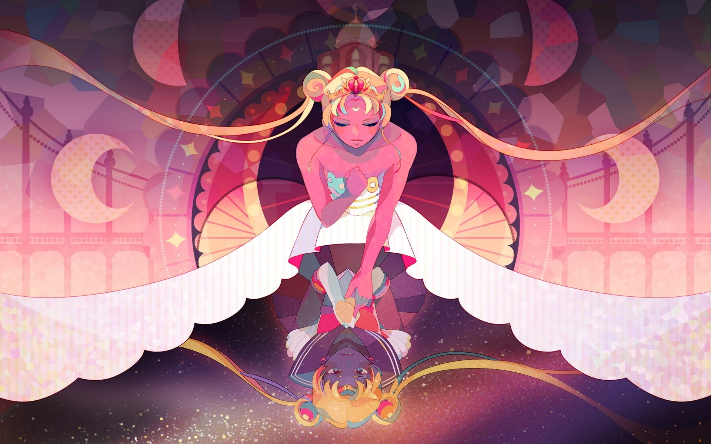

# 🌟 Magical Girl Character Sheet 🌟

Welcome to the **Magical Girl Character Sheet** project! This is a beautiful, interactive character sheet for your Tabletop RPG (TTRPG) magical girl adventures.

## ✨ Features
- Gorgeous, themed character sheet for magical girl campaigns
- Inventory, stats, skills, and notes sections
- Easy-to-use interface with magical icons and pastel colors
- Save and load your character data

## 🪄 Getting Started
1. Clone or download this repository.
2. Open `Content/html/CharacterSheet.html` in your web browser.
3. Start creating your magical girl character!

## 🎨 Screenshots

## 🧰 Technologies Used
- HTML, CSS, JavaScript
- Custom art and icons

## 💖 Contributing
Pull requests are welcome! For major changes, please open an issue first to discuss what you would like to change.

## 📜 License
This project is for personal and non-commercial use. Please credit the original author if you share or modify it.

---

*Transform, shine, and let your magical story begin!*
